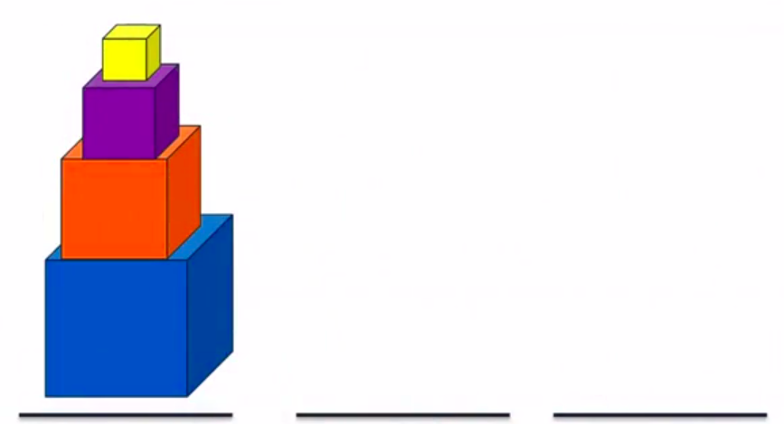

# Tower-of-Hanoi-Problem
Tower of Hanoi Problem is a mathematical puzzle where we have three stacks and 4 cubes. The objective of the puzzle is to move the entire cubes to another stack, obeying the following simple rules:

1. Only one cube can be moved at a time.
2. Each move consists of taking the upper cube from one of the stacks and placing it on top of another stack or on an empty stack.
3. No cube may be placed on top of a smaller cube.

The puzzle starts with the cubes in a neat stack in ascending order of size on one stack, the smallest at the top and the other two stacks empty.



You can play the game by cloning the repository and run this command in the terminal:

```bash
g++ main.cpp Game.cpp stack.cpp "NS/cube.cpp" -o main
```

then run the main file by typing this command in the terminal:

```bash
./main
```
